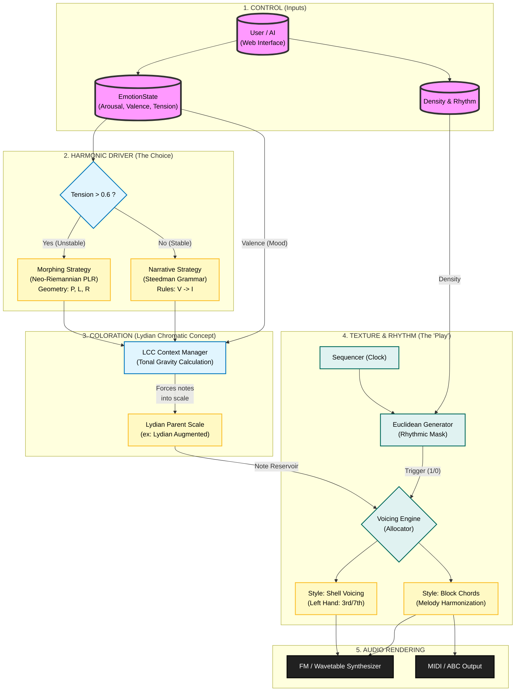

# Harmonium: a library for reactive procedural music generation based on emotions

Harmonium is a rust library to create procedural music with the help of math based
on emotions.

Design to be used in applications, websites and games.

## Method used

Harmonium is based on multiple layers.

1. The brain        Driver of the emotion (Russel)
2. The skeleton     Geometric rhythms (Euclidean)
3. The body         Adaptive chord progression (Steedman, Neo-Riemannienne)
4. The voice        Organic Melody (Fractal Noise)
5. The lung         DSP

### Brain

Everything starts with the state of the system (the emotion of the audience)

1. Arousal          Affect the speed and distortion
2. Valence          Affect the chords and the spacing
3. Tension          Affect the dissonance, the filtering and the geometry of rhythms
4. Density          Affect the number of notes

### Skeleton

* Bjorklund Algorithm: Distributes notes ("pulses") as evenly as possible within the measure ("steps"). This creates natural "groovy" rhythms (e.g., 3 hits on 8 = Tresillo).

* Polyrhythm (Steve Reich): Two sequencers run in parallel. The first takes 16 steps, the second 12. This creates a phase shift that evolves over time.

* Rotation (Necklace vs Bracelet): Tension changes the starting point of the rhythmic circle. The same distribution of notes sounds very different if shifted (rotation).

### The body

* **Generative Grammar (Steedman)** to create logical and resolving phrases (Jazz/Pop).

* **Neo-Riemannian Theory (PLR)** for geometric and dramatic transformations.

* **Unified Coloration**: All notes pass through the **Lydian Chromatic Concept (George Russell)** to ensure harmonic coherence ("Tonal Gravity") regardless of complexity.

* **Emotional Palettes**: The system selects a chord progression (I-IV-V, i-vii°, etc.) based on the emotional quadrant (e.g., "Sad & Tense" vs "Happy & Calm").

* **Inertia (Hysteresis)**: To prevent the music from changing "style" chaotically, the system waits for a significant emotional change before switching progressions.

### The voice

* Hybrid Generation (Biased Random Walk): Combines the long-term structure of Fractal Pink Noise (1/f) with the local harmonic rules of Markov Chains. The fractal noise acts as a "GPS" guiding the general direction, while Markov chains ensure each step makes musical sense.

* Smoothness Control: The Hurst exponent allows adjusting the melody from erratic (low smoothness) to lyrical and conjunct (high smoothness).

### The lung

Sound is sculpted in real-time via fundsp:

* FM Synthesis: Uses a modulator and a carrier. As Tension rises, the FM ratio increases, creating inharmonic sounds (bell/metallic type).

* Articulation (Anti-Legato): Note duration changes dynamically.
  * Low tension = Long and connected notes (Legato).
  * High tension = Short and percussive notes (Staccato).

* Possibility to manually configure SoundFont sample on each sound channel (Will be reworked with something more procedural in the choice of sample based on the emotion)

### Melodic Driver

It prevents monotony by alternating between **Stability** (functional rules) and **Instability** (mathematical transformations) according to the desired tension curve.

### Lydian Chromatic Concept (The Filter)

Based on the work of George Russell, this module does not view music as Major/Minor, but as a gradient of **Tonal Gravity** (Ingoing vs Outgoing).

* **Low Tension**: Forces notes towards the fundamental Lydian scale (Consonance).
* **High Tension**: Allows notes from Augmented/Diminished Lydian scales (Rich Dissonance).

### Steedman & PLR (The Generators)

* **Steedman:** Uses syntax trees to ensure the music "tells a story" (beginning, middle, end).
* **PLR (Neo-Riemannian):** Uses topology (the *Tonnetz*) to connect chords that are tonally unrelated but geometrically close.

## ML integration

To control the emotions dynamically to help to music evolve the library include ML integration
to run a tensorflow model to transform words into parameters to control the value of our emotions.

## Diagram

## Usefull sources

Here are the books that made this project possible

### Fondation and Geometric Music

* Loy, Gareth (2006). *Musimathics: The Mathematical Foundations of Music*.
* Toussaint, Godfried (2013). *The Geometry of Musical Rhythm*.
* Van Heerden, Derrick Scott (2018). *Music, Geometry and Mathematics*.
* Russell, G. (2001). *The Lydian Chromatic Concept of Tonal Organization*.
* Steedman, M. J. (1984). *A Generative Grammar for Jazz Chord Sequences*.
* Cohn, R. (1998) & Lewin, D. (1987). *Generalized Musical Intervals and Transformations*.

### Algorithmes Rythmiques

* Toussaint, Godfried (2005). The Euclidean Algorithm Generates Traditional Musical Rhythms
* Milne, A. J., Bulger, D., & Herff, S. A. (2017). Exploring the space of perfectly balanced rhythms and scales
* Carey, Norman & Clampitt, David (1989). Aspects of well-formed scales.

### Procedural

* Hiller, Lejaren & Isaacson, Leonard (1959). Experimental Music

## Library used

Here are the library that make this project possible

Music generation:

* rust-music-theory

Sound generation:

* FunDSP
* oxysynth

Sound output:

* cpal (device)
* hound (wav)
* midly (midi)

ML:

* candle
* tokenizers