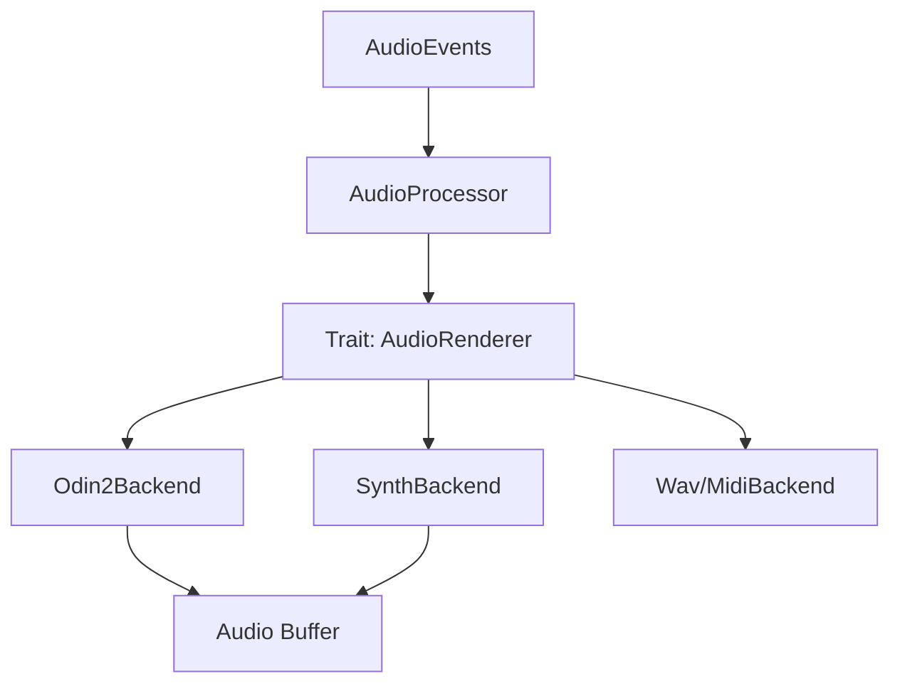

# Harmonium Audio

`harmonium_audio` is the sound generation engine for the Harmonium project. It consumes abstract `AudioEvent`s from `harmonium_core` and renders them into audio signals using various synthesis backends.

## Architecture

The system is designed around the **`AudioRenderer`** trait, allowing for hot-swappable audio backends. The **`AudioProcessor`** wraps the active renderer and exposes a simplified API for event handling and buffer processing.



## Key Modules

### 1. Backends (`src/backend`)

*   **`Odin2Backend` (Primary)**:
    *   Utilizes `odin2-core`, a Rust port of the powerful Odin 2 synthesizer.
    *   **Multi-timbral**: Manages 5 independent synth engines (Bass, Lead, Snare, Hat, Poly).
    *   **Emotional Morphing**: Implements a unique feature where instrument presets are mapped to the 4 quadrants of Russell's Circumplex (Anger, Joy, Sadness, Calm). The engine bilinearly interpolates between these presets in real-time based on the `Valence` and `Arousal` parameters.

*   **`SynthBackend` (Fallback/Lightweight)**:
    *   **Hybrid Engine**: Combines `fundsp` (Functional DSP) for subtractive/FM synthesis and `oxisynth` for SoundFont playback.
    *   Constructs a hardcoded DSP graph for basic drums and synths when Odin2 is not available or too heavy.

*   **`MidiBackend` & `WavBackend`**:
    *   Specialized backends for exporting the session to standard MIDI or WAV files.

### 2. Synthesis (`src/synthesis`)
Contains the logic for the **Emotional Morphing** system.
*   **`EmotionalMorpher`**: Handles the parameter interpolation logic.
*   **`presets.toml`**: Defines the parameter mappings for different emotional states.

### 3. Voicing (`src/voicing`)
Implements advanced jazz voicing algorithms to transform simple melodies into rich harmonic textures.
*   **`BlockChordVoicer`**: Implements "Shearing-style" (locked hands) block chords, harmonizing the melody with close-position chords.
*   **`ShellVoicer`**: Generates "Shell voicings" (Root, 3rd, 7th) common in Be-Bop and comping.
*   **`Drop-2`**: A utility to spread open close voicings for a more open sound.

## Dependencies

*   **`odin2-core`**: The synthesis engine (optional feature `odin2`).
*   **`fundsp`**: For functional DSP graph construction.
*   **`oxisynth`**: A SoundFont 2 synthesizer.
*   **`hound`**: For WAV encoding.
*   **`midly`**: For MIDI encoding.

## Usage

```rust
use harmonium_audio::{AudioProcessor, backend::odin2_backend::Odin2Backend};

// 1. Initialize the backend
let sample_rate = 44100.0;
let backend = Box::new(Odin2Backend::new(sample_rate));

// 2. Create the processor
let mut processor = AudioProcessor::new(backend);

// 3. In audio callback
let output_buffer = &mut [0.0; 512]; // Stereo buffer
let events = vec![]; // Events from core

processor.process_events(&events);
processor.process_audio(output_buffer, 2);
```
